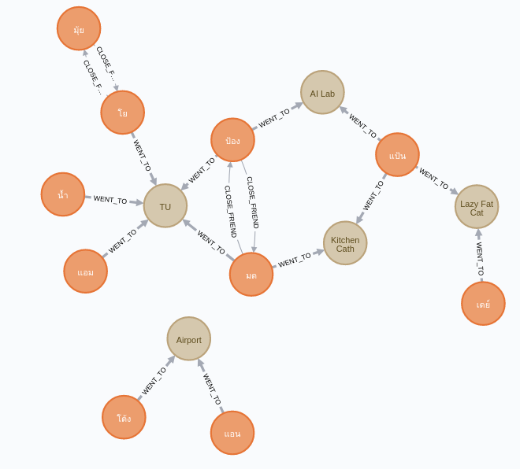

# TU Covid-19 Graph Database
ใช้ [Neo4j](https://neo4j.com/) เป็น Graph Database แล้วใช้ Python ในการดึงข้อมูลโดยใช้ [Py2neo](https://py2neo.org/v4/) driver แล้วใช้ [vis.js](https://visjs.org/) ในการแสดงผล

## Setup
1. Run Neo4j, type
    ```
    docker-compose up
    ```
2. (Optional) Create Python virtual environment
    ```
    conda create -n yourenvname python=x.x
    source activate yourenvname
    conda install ipykernel
    ipython kernel install --user --name=<any_name_for_kernel>
    ```
3. Install Python libraries
    ```
    Run pip install -r requirements.txt
    ```
4. See [`demo_covid_data.ipynb`](./demo_covid_data.ipynb) for example of how to use Python with Neo4j

5. Set environment variable
https://docs.conda.io/projects/conda/en/latest/user-guide/tasks/manage-environments.html#setting-environment-variables




The above image shows the mock data we used taken from Neo4j Browser. 
